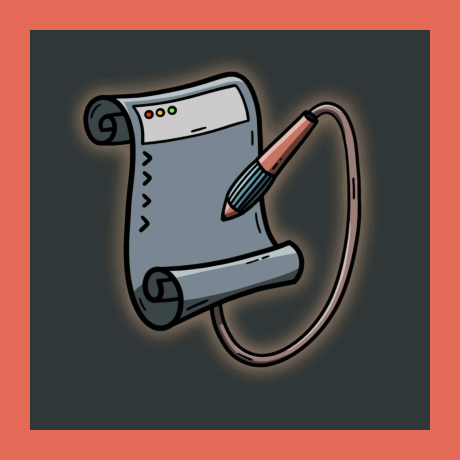

  

  <i>Your technical documentation team</i>  
  <a href="https://ritza.co">ritza.co</a>

<h1 align="center">
Example Technical Documentation site
</h1>

 

This is the repository to accompany our [How to build a technical documentation site](https://docs.ritza.co) guide. Read the [quickstart](https://docs.ritza.co/getting-started/quickstart/) to see how to replicate it, or just clone this and figure it out on your own.

If you need help, we'll do it for you. See [ritza.co](https://ritza.co) for more.
