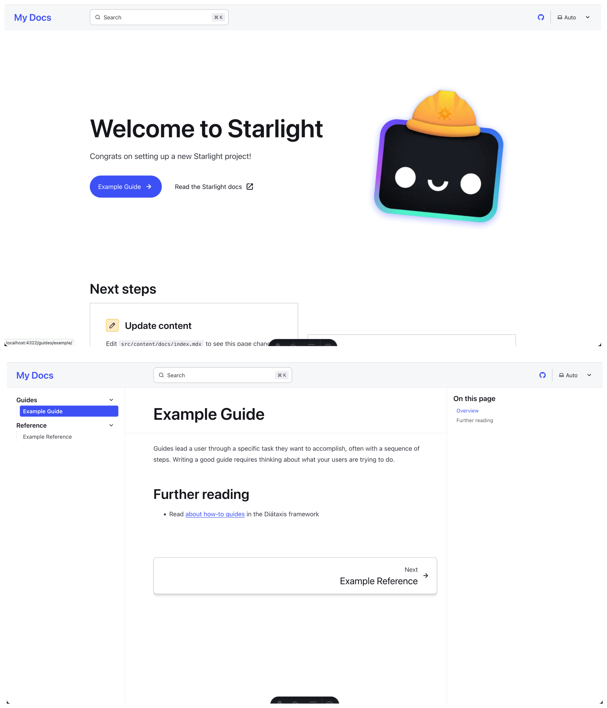

:::tip[Need help?]
At [Ritza](https://ritza.co), we offer a ready-to-go professional team of engineering writers and editors to build your documentation for you.
:::

Here's how to speedrun the set up of your initial technical documentation site.

People are often surprised by how many decisions can go into building a technical documentation site. If you haven't done it before, you'll probably find that the list of things you need to think about grows as you go.

Here's a quickstart guide with all the decisions made for you (but with some branch points in case you want to make different decisions).

If you're looking to launch a documentation site on a timeline of a few days to a couple of weeks, then you can just follow the steps exactly.

Here's a summary of what we'll take you through

1. Start an Astro Starlight project
2. Configure it and add some content
3. Push it to a new GitHub repository
4. Deploy it
5. Add a domain
6. Add Plausible analytics

Each step links out to a page with more context and some alternatives, but this page gives you a happy path so you can go live as quickly as possible.

## Start an Astro Starlight project

Visit the [Astro Starlight getting started page](https://starlight.astro.build/getting-started/), and follow the instructions to create a new project. There are a few options you might have opinions about like using yarn vs npm. If you don't, the following should work for you (as long as you have a node environment set up locally).

```
npm create astro@latest -- --template starlight docs --install --git --no --skip-houston
```

This will create a new Astro Starlight project in a `docs` subfolder in your current directory. It preselects options from the default setup wizard and tells it not to run (`--skip-houston`), so you'll have your git repository initialised, dependencies will be installed, and it will use the default TypeScript option.

Change into the docs folder and run `astro dev` to run the local server and see the start of your docs project. It looks pretty similar to this site, with an example landing page and a docs site with different categories.



We like Astro Starlight because it has a good mix of functionality and aesthetics, and great defaults (e.g. working search out of the box, image optimization, etc).

Read [choosing a docs platform](#) for other options.

## Configure Astro Starlight

The defaults are pretty good, but you'll want to change the following configuration in the `astro.config.mjs` file and in the `index.mdx` file at a minimum.

- Add your name
- Add the full domain that your documentation site will be hosted at
- Choose the categories that you want for your documentation pages 

Replace your entire `astro.config.mjs` file with the following, making changes as needed on the highlighted lines. The Plausible script is for analytics that we'll set up later.

```js {5,8, 14, 19}
import { defineConfig } from 'astro/config';
import starlight from '@astrojs/starlight';

export default defineConfig({
    site: 'https://docs.ritza.co',
	integrations: [
		starlight({
			title: 'Ritza Documentation',
            head: [
                {
                  tag: 'script',
                  attrs: {
                    src: 'https://plausible.io/js/script.js',
                    'data-domain': 'docs.ritza.co',
                    defer: true
                  }
            }],
			social: {
				github: 'https://github.com/ritza-co/docs.ritza.co/',
			},
			sidebar: [
				{
					label: 'Getting started',
					autogenerate: { directory: 'getting-started' },
				},
				{
					label: 'How to',
					autogenerate: { directory: 'how-tos' },
				},
				{
					label: 'Reference',
					autogenerate: { directory: 'reference' },
				},
			],
		}),
	],
});
```

The `src/content/docs/index.mdx` file configures what is shown on the main landing page. For now you can remove all of the content and keep only frontmatter, similar to the following.

```yaml {2,3,6,8,10}
---
title: How to build a technical documentation site
description: Technical Documentation as a Service
template: splash
hero:
  tagline: Speedrun technical documentation for your startup
  image:
    file: ../../assets/ritza.co.png
  actions:
    - text: Read the guide
      link: /getting-started
      icon: right-arrow
      variant: primary
---
```

## Add some content

Now you're ready to add the actual documentation (this is probably the hard part.)

In the `src/content/docs` folder create new subdirectories for each category. If you copied the example above, then do the following

```
mkdir getting-started how-tos reference
```
In each folder, create one `.mdx` file per page you want to add in that category. We recommend following the structure you see here: add two top level pages in the first section `index.mdx` and `quickstart.mdx`.

1. An [introduction page](/getting-started), that explains in technical detail what your product does. Include screenshots if possible.

2. A quickstart page, that explains how a user can onboard to your product and try it out as quickly as possible, like this one.

See [structure and categories of technical documentation](#) for more.

## Push it to a new GitHub repository

Create a new blank GitHub repository in your GitHub organization and push the project there. 

We like using a separate repository because it keeps you nimble, and doesn't tie your documentation releases to your product ones, but read [source control structure for your documentation](#) for more information about the tradeoffs and some other options.

## Deploy it

You'll likely already know how to deploy a static site somewhere. Use that method. If you don't, you can use GitHub pages by following [this guide](#).

## Add a domain

Create the subdomain `docs.example.com` (change example.com to your actual domain) in your DNS provider and point it to the site.

Set up HTTPS if that's not already done.

See [subdomain or subfolder](#) for some more information about the tradeoff here.

## Add analytics

Set up [Plausible](http://plausible.io) to track basic analytics so you know if people are actually reading your documentation and which pages are the most popular.

We like Plausible because you don't need to add annoying cookie banner warnings, it's much easier to use than Google Analytics, and it's easy to export the data when you need.

See [choose an analytics solution](#) for more information about the tradeoffs here.


