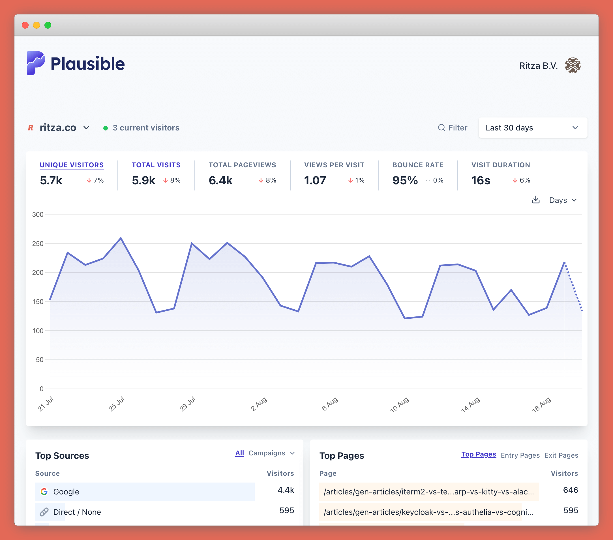

You'll probably want to know how many people are using your technical documentation and which pages they are using the most. 

You might also want to track events. Especially if you regard your documentation as part of your sales funnel, you'll want to track how many people end up navigating from specific documentation pages to your sign up or demo page on your marketing site.

Some people choose to also track usage more closely, including watching people's mouse movements and scroll actions on each specific page. We find this creepy, but we'll include some guidance about that too in case you need it.

## Choosing an analytics platform

Our favourite analytics platform is [Plausible](http://plausible.io). It's much simpler than Google Analytics, but powerful enough to still give you everything you need. This for us is mainly

* Total Page views (so you can count the total number of times that your documentation site gets visited)
* Total User views (so you can see how many unique people visit your documentation site)
* Views and Users per page (so you can see which of your pages are the most popular)
* Different time segments (e.g. views per week for the last 12m months) 
* Goals/Events (e.g., user visited your demo page or downloaded an ebook)

You can either pay Plausible to host it for you, or host the community edition yourself for free. 

This is what a dasboard looks like 

Instead of Plausible you might go with 

* Google Analytics - this has the most features, but it's counter-intuitive to use, and they have a nasty habit of making breaking changes between releases (e.g. recently they made people upgrade from Universal Analytics to Google Analytics 4 but didn't provide a way to migrate data so users couldn't compare historical statistics). It's a good choice if you need to integrate into other Google products (like Google ads), or if you're used to its quirks already and don't want to learn something new.
* Simple Analytics - very comparable to Plausible, but not open source.

## More invasive tracking

In addition to basic view tracking, you might want to track what people do on your documentation site more closely. Platforms like HotJar let you record individual user settings, seeing exactly how long people stay on a page, where they scroll to, and what they do with their mouse.

This is kind of creepy and we've had some bad experiences with HotJar's statistics in the past where they seemed to be making up a lot of data (after extensive conversation with their support team they admitted the data was wrong and claimed it was a bug), but using a platform like HotJar does give you some very high-level summary metrics that might be useful to include in internal reports or to prove to your boss that you're adding value.

Microsoft Clarity is a similar tool that you might want to try.

Our recommendation is that you use as little tracking as you can though!

