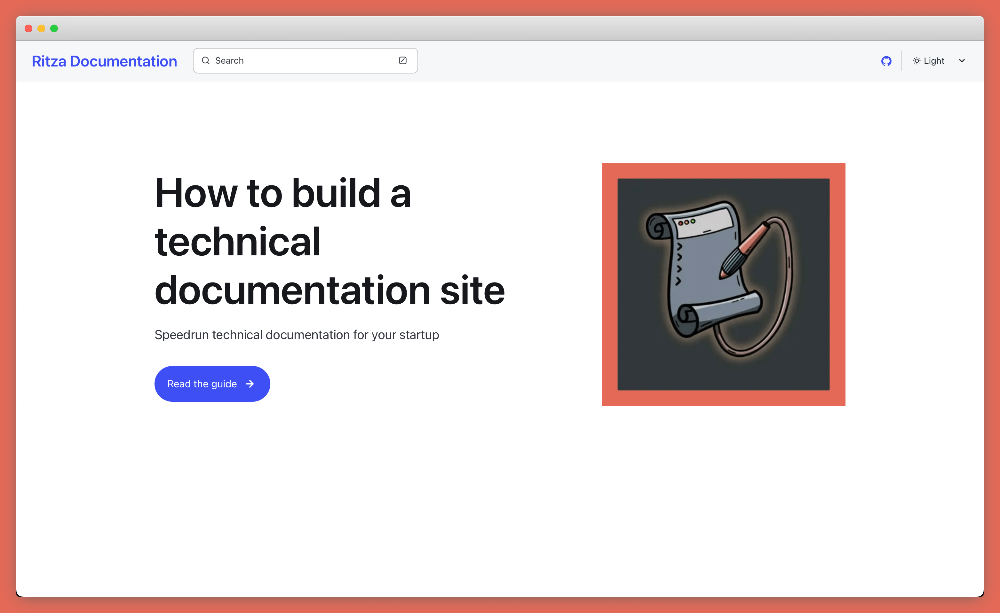
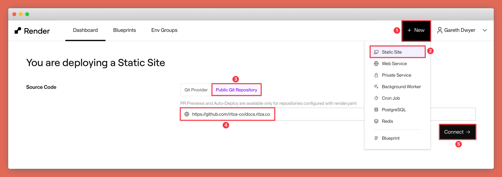
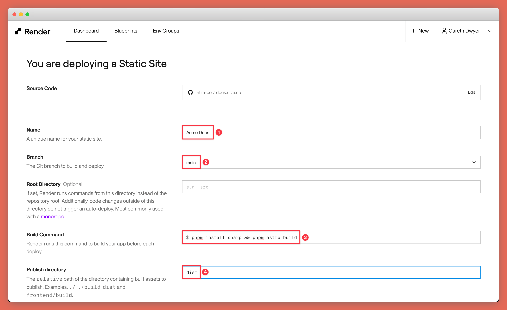
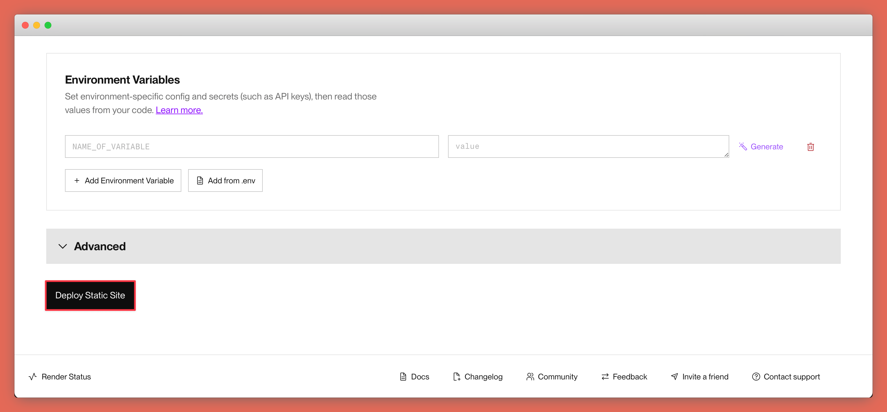
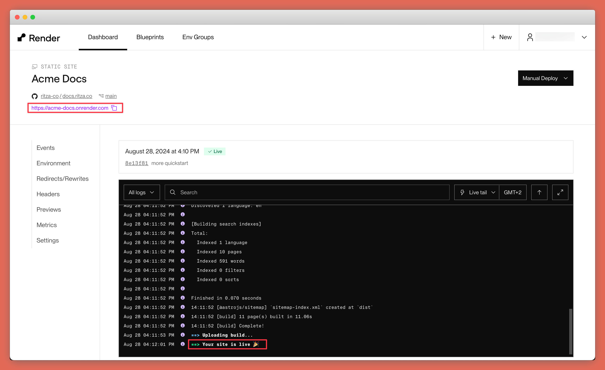
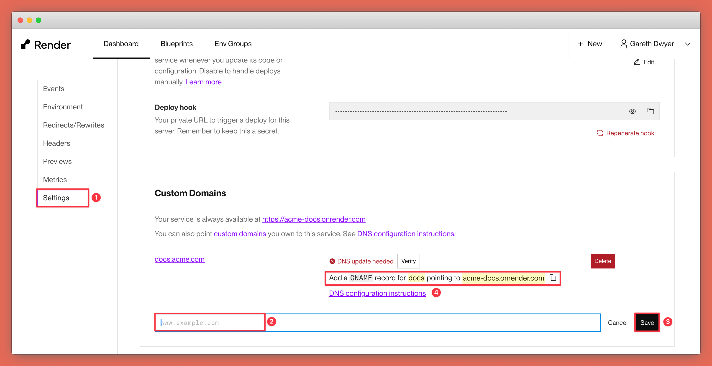

There are many options to deploy your site, but Render offers a free plan for static sites that includes free preview environments and a free CDN, so it's a great option if you don't already have a favourite way to deploy static sites.

Here we'll cover how to deploy the documentation repository that we showed you how to set up in the [quickstart](/quickstart) to Render. If you prefer, you can just use [the repository from the site you're on right now](https://github.com/ritza-co/docs.ritza.co). 

At the end, you'll have your documentation site running on a custom domain.

## 1. Create a new project on Render

Sign up at Render.com if you don't already have an account.

On the dashboard do the following:

1. Click "New"
2. Choose "Static Site"
3. Go to the "Public Git Repository" tab (or you can choose "Git Provider" and link your GitHub account if your docs repository is private)
4. In the input paste the URL of your GitHub project (or use `https://github.com/ritza-co/docs.ritza.co` if you just want to test it out)
5. Press "Connect"

## 2. Configure the new Render project

1. Under "Name" call your project something like "Acme Docs" (change to your own company's name)
2. Leave the git branch as "main" or change this if your repository uses a different branch name
3. Under build command add `pnpm install sharp && pnpm astro build` (only the second part should be necessary but we got a build error about sharp not being installed without this)
4. Add `dist` as the publish directory (this is where Astro builds the site to by default, so Render will serve the HTML content from this location and ignore your markdown source files after the build is complete)

Leave the other options as the defaults provided and press "Deploy Static Site" at the bottom of the page.

## 3. Build and test your project

On the next page, Render will automatically start building your project. Give it a minute or two, and you should see a "Your site is live" message indicating success. 

Navigate to the 'onrender.com' url provided and check that everything is working as expected.

## 4. Add a custom domain

You probably don't want your visitors to have to visit a domain like `acme-docs.onrender.com`.

Navigate to "Settings" in the left sidebar, scroll down to the "Custom Domains" section, and add a subdomain to your main domain. 

In your DNS provider (for example, Namecheap, AWS Route S3, or Cloudflare), add the CNAME that Render gives you.

Wait for a bit (DNS is slow) and you should be able to visit your documentation site at your chosen subdomain.

