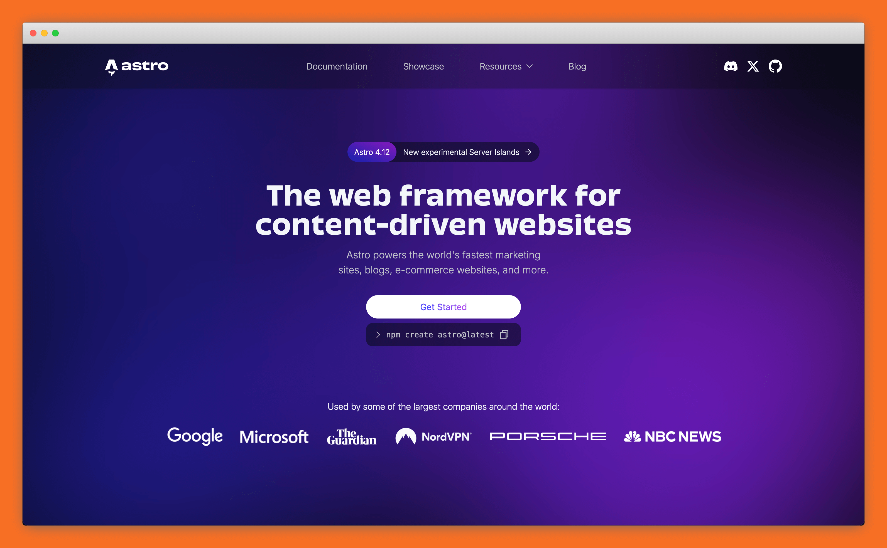

Taking good-looking screenshots of your UI to include in your technical documentation is probably more complicated than you think. At a minimum you'll want to 

* Take screenshots on a high-quality monitor, preferably retina or 4k
* Think carefully about zoom levels, cropping, and annotations. We have more detailed guidance on how we [take good screenshots](https://styleguide.ritza.co/screenshots/screenshot-guidelines-for-technical-documentation/), but consistency is key even if you choose different options than us.
* Optimize the file size using a tool like [TinyPNG](https://tinypng.com) (using the free web UI is fine at the start, and you can automate this using their API when you need).
* Optionally, add a background and minimal fake browser heading using a tool like [BrowserFrame](https://browserframe.com).

Our flow for taking good screenshots manually is loosely

* Follow the steps in your product to get to the correct screen
* Size the window if necessary
* Take the screenshot using CleanShotX
* Add any callouts or annotations
* Paste it into BrowserFrame and add a background colour that matches your brand
* Download that and upload it to TinyPng
* Download that, rename the optimized file, and move it to the correct place in your documentation project

This results in a screenshot that looks like the one below.

Most of these steps can be automated as you scale.

