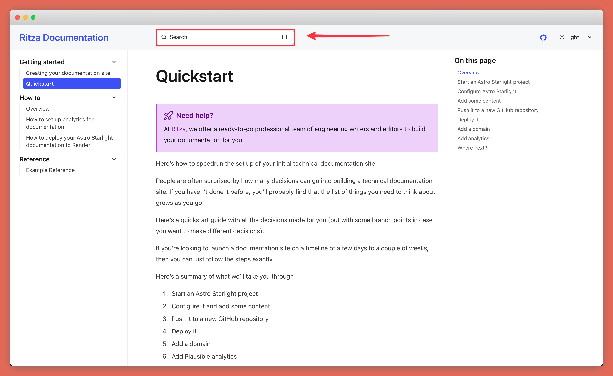

You've built something great, but now you want to show it to your customers.

Ideally, your customers would just 'get it', but they don't. Each one needs hand-holding and manual onboarding, and this doesn't scale.

Hire Ritza to build out professional technical documentation. We won't only explain the "how", but also the "what" and the "why" to help your users understand your product or platform and take the shortest path to where they can get value out of it.

We'll ask the stupid questions, so that your users don't have to. But our writers are all engineers, so they'll figure things out on their own and write them down. We won't have to bug your team for every small problem, but we will share bug reports and our feedback on how things could be made smoother at the same time.

We'll build you a documentation site like this one (or using a different framework if you prefer).

All you need to do is onboard us to your product, as you would any of your customers. Open tickets on GitHub, send us messages on Slack, push up bullet point drafts of documentation pages you need -- whatever is easiest for you.

We'll take that and turn it into technical documentation for your users.

Our primary goal will be to make it as easy as possible for your customers to onboard and use your product, but we understand the importance of presentation too, so we'll show off your platform at its best.

With 4k screenshots, consistent grammar, and clear structures, your users won't be cursing as they build.

